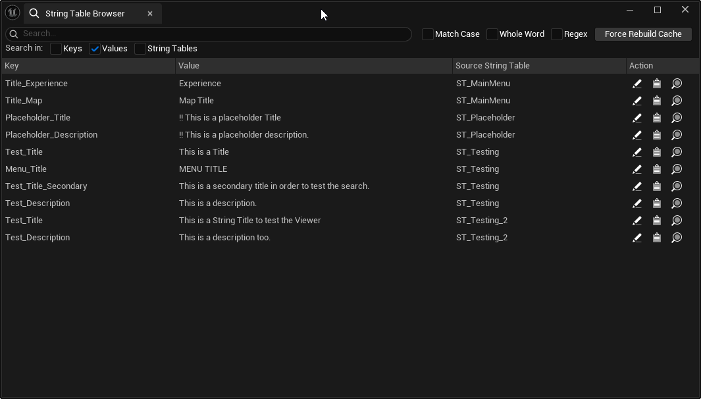
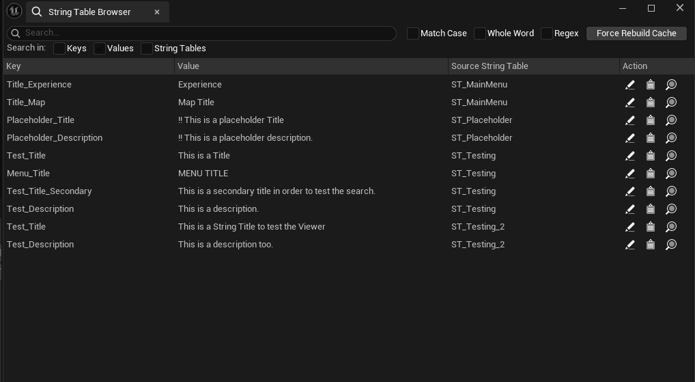
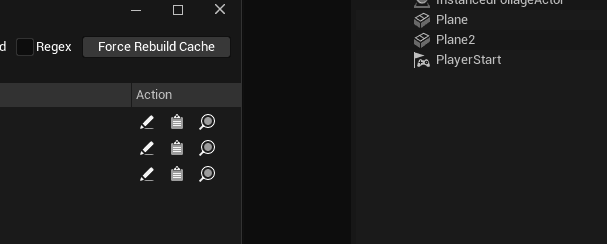
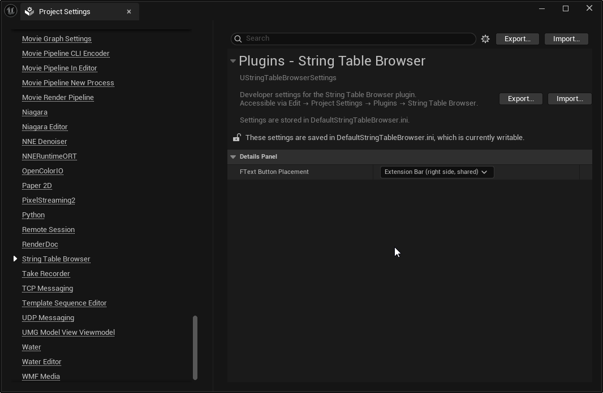
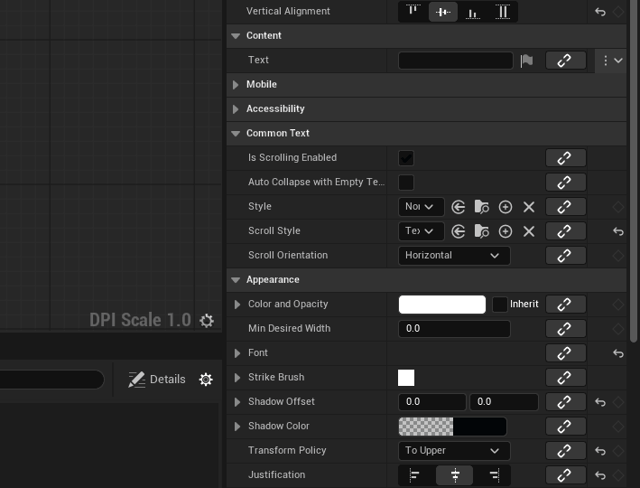

# String Table Browser

An Unreal Engine editor plugin that lets you browse, search, and bind every string table entry in your project from a single panel.

<!-- Replace the placeholder below with a screenshot of the main browser panel -->


---

## Features

- **Unified view** — all string tables across your project displayed in one flat list, grouped by source asset
- **Live search** — filter entries as you type, scoped to whichever fields you choose, with 150ms debouncing for responsiveness on large datasets
- **Search scope** — toggle which fields are searched: Keys, Values, and/or String Table names. Defaults to Values only
- **Search modes** — plain text, match case, whole word, and full regex support
- **Sortable columns** — click any column header to sort ascending or descending
- **Row actions** — three icon buttons per row: open the asset editor, copy a `LOCTABLE()` reference, or open the native Reference Viewer
- **Details panel integration** — a search icon button appears on every `FText` property row in the Details panel, opening a compact search dropdown to bind the property to a string table entry directly
- **Configurable button placement** — choose whether the Details panel button appears in the shared extension bar (compatible with MVVM and other plugins) or next to the property label, via Project Settings
- **Incremental cache** — the plugin listens to the Asset Registry and updates automatically when string tables are added, removed, or modified
- **Disk cache** — the entry list is persisted to disk so the panel is populated instantly on editor startup without re-scanning all assets

---

## Requirements

- Unreal Engine 5.x
- C++ project (the plugin must be compiled from source)

---

## Installation

1. Copy the `StringTableBrowser` folder into your project's `Plugins/` directory:

```
YourProject/
└── Plugins/
    └── StringTableBrowser/
        ├── StringTableBrowser.uplugin
        ├── Docs/
        │   ├── README.md
        │   ├── IMPLEMENTATION.md
        │   └── CHALLENGES.md
        ├── Resources/
        │   ├── Icon16.png
        │   └── Icon40.png
        └── Source/
            └── StringTableBrowser/
                ├── StringTableBrowser.Build.cs
                ├── Public/
                │   ├── StringTableBrowserModule.h
                │   ├── StringTableBrowserSettings.h
                │   ├── StringTableSearchFilter.h
                │   ├── SStringTableBrowser.h
                │   ├── SStringTableBrowserPickerDropdown.h
                │   └── FTextStringTableBrowserDetailCustomization.h
                └── Private/
                    ├── StringTableBrowserModule.cpp
                    ├── SStringTableBrowser.cpp
                    ├── SStringTableBrowserPickerDropdown.cpp
                    └── FTextStringTableBrowserDetailCustomization.cpp
```

2. Right-click your `.uproject` file and select **Generate Visual Studio project files** (Windows) or **Generate Xcode project** (Mac).

3. Build the **Editor** target from your IDE. The plugin compiles automatically as part of the project.

4. Open the Unreal Editor. If the plugin does not appear automatically, go to **Edit → Plugins**, search for **String Table Browser**, enable it, and restart the editor.

---

## Opening the Panel

The **String Table Browser** entry appears in the **Tools** menu of three editors:

- **Level Editor** — the primary entry point, always available
- **String Table Editor** — when editing a string table asset directly
- **Widget Blueprint Editor** — when editing a Widget Blueprint

All three open the same docked browser tab. If the tab is already open, focus is moved to it rather than spawning a duplicate.

---

## Usage

### Searching

Type in the search box to filter all entries in real time. The filter runs 150ms after the last keystroke (debounced) to keep the UI responsive on large datasets. Toggle changes (Match Case, Whole Word, Regex, scope) apply immediately since they fire at most once per click.

<!-- Replace with a gif showing live search filtering -->


#### Search Scope

The **Search in** toggles beneath the search box control which fields are matched against your search term. By default only **Values** is enabled.

| Toggle | Field searched | Example |
|---|---|---|
| **Keys** | The unique string identifier used to reference the entry in code | `MAIN_MENU_TITLE` |
| **Values** | The human-readable string displayed in game | `Start Game` |
| **String Tables** | The name of the source string table asset | `UI_Strings` |

If no entries match the current search, a **No entries match your search** message is shown in the list area. If the search box is empty, all entries are displayed.

#### Search Modes

| Option | Behaviour |
|---|---|
| **Match Case** | Search is case-sensitive. Works with plain text, Whole Word, and Regex. |
| **Whole Word** | Only matches complete words, not substrings. For example, searching `table` will not match `StringTable`. |
| **Regex** | Interprets the search input as a regular expression (ICU syntax). See [Regex examples](#regex-examples) below. |

Match Case can be combined with any mode. Whole Word and Regex are mutually exclusive — if both are enabled, Regex takes precedence.

#### Regex Examples

| Pattern | What it matches |
|---|---|
| `^Hello` | Entries whose searched field starts with `Hello` |
| `String\|Table` | Entries containing either `String` or `Table` |
| `This is a \w+` | Entries matching the phrase followed by any single word |
| `\d{3,}` | Entries containing a number with 3 or more digits |

> **Note:** The `^` anchor applies to the beginning of the entire search target string, not to each field individually. If multiple scope fields are enabled, they are concatenated with a space before matching.

### Row Actions

Each result row has three icon buttons in the Action column:

| Icon | Action | Description |
|---|---|---|
| ✏️ Edit | `Icons.Edit` | Opens the source string table asset in the Unreal string table editor |
| 📋 Copy | `Icons.Clipboard` | Copies a `LOCTABLE()` reference for this entry to the clipboard |
| 🔍 References | `Icons.Find` | Opens Unreal's native Reference Viewer for the source string table asset, showing the full asset dependency graph |

The `LOCTABLE()` reference copied by the Copy action is paste-ready in C++ source files, Blueprint string table reference pins, and any Unreal property that accepts a localised string reference:

```cpp
LOCTABLE("/Game/Localization/MyTable.MyTable", "MY_KEY")
```

<!-- Replace with a gif showing the three row action buttons in use -->


### Forcing a Cache Rebuild

Click **Force Rebuild Cache** in the toolbar to discard the current cache and re-scan all string table assets from scratch. Use this if you've synced changes from version control and the panel isn't reflecting them.

> **Note:** The cache only populates entries for string table assets that are already loaded in memory at startup. Assets are loaded on demand as you work. If an asset you expect to see is missing, open it in the Content Browser and click Force Rebuild Cache.

---

## Plugin Settings

Go to **Edit → Project Settings → Plugins → String Table Browser** to configure the plugin.

<!-- Replace with a screenshot of the Project Settings page -->


### FText Button Placement

Controls where the search button appears on `FText` property rows in the Details panel.

| Option | Description | When to use |
|---|---|---|
| **Extension Bar** *(default)* | Button appears in the shared right-side extension bar, alongside buttons from other plugins | Use when other plugins (e.g. MVVM) also add buttons to FText rows |
| **Next to Property Label** | Button appears inline to the right of the property name label | Use when you prefer the button always visible and don't have conflicting plugins |

The setting is stored in `Config/DefaultStringTableBrowser.ini` and is project-scoped, so it commits to source control and applies to all team members.

---

## Details Panel Picker

Every `FText` property in the Details panel gets a small search icon button injected into its property row. This lets you bind an `FText` property to a string table entry without leaving the Details panel.

<!-- Replace with a gif showing the picker dropdown opening and applying an entry -->


### Opening the Picker

Click the **search icon** (🔍) on any `FText` property row. A compact dropdown opens anchored below your cursor, containing the same search bar and toggles as the main viewer.

### Searching

The picker starts empty — type to begin searching. The same search scope and mode toggles from the main viewer are available: Match Case, Whole Word, Regex, and scope toggles for Keys, Values, and String Tables.

**The search box is pre-populated** with the property's current value on first open, so you can immediately refine an existing binding. After that, the last search term you typed is remembered for the lifetime of the Details panel instance, regardless of what the property is set to.

### Applying an Entry

Click the **✓ (Apply)** button on any result row to bind the `FText` property to that entry. This sets the property to a proper string table reference equivalent to:

```cpp
FText::FromStringTable("TableId", "Key")
```

The binding is fully compatible with Unreal's localization pipeline, supports undo/redo, and correctly dirties the asset for saving.

### Opening the Full Browser

Click **Open String Table Browser** in the dropdown footer to open the main panel for more advanced browsing. The dropdown closes automatically and the browser tab is focused or spawned.

### Picker Search Behaviour vs Main Viewer

| Behaviour | Main Browser | Details Panel Picker |
|---|---|---|
| Empty search | Shows all entries | Shows nothing (type to search) |
| No results message | "No entries match your search." | "No entries match your search." |
| Default scope | Values | Values |
| Remembers last search | Per session | Per Details panel instance |
| Row actions | Edit, Copy, References | Apply (bind FText), Copy |

---

## How the Cache Works

The plugin maintains two levels of cache:

- **In-memory cache** — a `TMap` keyed by package name, holding all entries per table. This is rebuilt incrementally as the Asset Registry reports changes.
- **Disk cache** — written to `Saved/StringTableBrowserCache.json` after every rebuild. On startup, this file is loaded first to avoid scanning all assets. If the file is missing, outdated, or from an older plugin version, a full rebuild runs automatically.

The cache is versioned. Bumping `GStringTableBrowserCacheVersion` in `StringTableBrowserModule.h` will force all users to rebuild on their next editor launch, which is useful after schema changes.

---

## Troubleshooting

**The panel is empty on first launch.**
Open a string table asset in the Content Browser to load it into memory, then click **Force Rebuild Cache**. Alternatively, wait for the editor to finish its initial asset scan and reopen the panel.

**Entries are missing after a version control sync.**
The disk cache may be stale. Delete `Saved/StringTableBrowserCache.json` and restart the editor, or click **Force Rebuild Cache**.

**The plugin doesn't appear in the Tools menu.**
Confirm the plugin is enabled under **Edit → Plugins**. If it was just enabled, a full editor restart is required.

**The search icon button doesn't appear on FText properties.**
The Details panel customization loads during `PostEngineInit`. If the button is missing, confirm the plugin is enabled and the editor has fully finished loading before inspecting a property. Hot-reloading the plugin mid-session may also require a full editor restart.

**Clicking Apply shows a missing string table entry error.**
The string table asset may not be loaded in memory. Open the asset in the Content Browser and try again. If the entry still doesn't resolve, click **Force Rebuild Cache** to ensure the cache reflects the current state of your assets.

**The plugin fails to compile.**
Check that `"LevelEditor"`, `"PropertyEditor"`, `"DetailCustomizations"`, `"AssetManagerEditor"`, `"DeveloperSettings"`, and all other module dependencies listed in `StringTableBrowser.Build.cs` are present. Some modules shift between engine minor versions — check the Output Log for the specific missing symbol.

**The button placement setting has no effect.**
Close and reopen any Details panel that was already open when you changed the setting. The customization is rebuilt the next time a Details panel refreshes its layout.

---

## License

MIT — do whatever you like with it.
